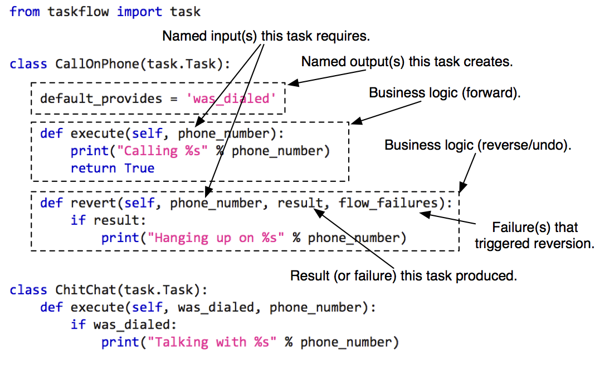

------------------------
Atoms, tasks and retries
------------------------

Atom
====

An :py:class:`atom <taskflow.atom.Atom>` is the smallest unit in TaskFlow which
acts as the base for other classes (its naming was inspired from the
similarities between this type and `atoms`_ in the physical world). Atoms
have a name and may have a version. An atom is expected to name desired input
values (requirements) and name outputs (provided values).

.. note::

    For more details about atom inputs and outputs please visit
    :doc:`arguments and results <arguments_and_results>`.

.. automodule:: taskflow.atom

.. _atoms: http://en.wikipedia.org/wiki/Atom

Task
=====

A :py:class:`task <taskflow.task.Task>` (derived from an atom) is a
unit of work that can have an execute & rollback sequence associated with
it (they are *nearly* analogous to functions). Your task objects should all
derive from :py:class:`~taskflow.task.Task` which defines what a task must
provide in terms of properties and methods.

**For example:**

Currently the following *provided* types of task subclasses are:

* :py:class:`~taskflow.task.Task`: useful for inheriting from and creating your
  own subclasses.
* :py:class:`~taskflow.task.FunctorTask`: useful for wrapping existing
  functions into task objects.

.. note::

    :py:class:`~taskflow.task.FunctorTask` task types can not currently be used
    with the :doc:`worker based engine <workers>` due to the fact that
    arbitrary functions can not be guaranteed to be correctly
    located (especially if they are lambda or anonymous functions) on the
    worker nodes.

Retry
=====

A :py:class:`retry <taskflow.retry.Retry>` (derived from an atom) is a special
unit of work that handles errors, controls flow execution and can (for
example) retry other atoms with other parameters if needed. When an associated
atom fails, these retry units are *consulted* to determine what the resolution
*strategy* should be. The goal is that with this consultation the retry atom
will suggest a *strategy* for getting around the failure (perhaps by retrying,
reverting a single atom, or reverting everything contained in the retries
associated `scope`_).

Currently derivatives of the :py:class:`retry <taskflow.retry.Retry>` base
class must provide a :py:func:`~taskflow.retry.Retry.on_failure` method to
determine how a failure should be handled. The current enumeration(s) that can
be returned from the :py:func:`~taskflow.retry.Retry.on_failure` method
are defined in an enumeration class described here:

.. autoclass:: taskflow.retry.Decision

To aid in the reconciliation process the
:py:class:`retry <taskflow.retry.Retry>` base class also mandates
:py:func:`~taskflow.retry.Retry.execute`
and :py:func:`~taskflow.retry.Retry.revert` methods (although subclasses
are allowed to define these methods as no-ops) that can be used by a retry
atom to interact with the runtime execution model (for example, to track the
number of times it has been called which is useful for
the :py:class:`~taskflow.retry.ForEach` retry subclass).

To avoid recreating common retry patterns the following provided retry
subclasses are provided:

* :py:class:`~taskflow.retry.AlwaysRevert`: Always reverts subflow.
* :py:class:`~taskflow.retry.AlwaysRevertAll`: Always reverts the whole flow.
* :py:class:`~taskflow.retry.Times`: Retries subflow given number of times.
* :py:class:`~taskflow.retry.ForEach`: Allows for providing different values
  to subflow atoms each time a failure occurs (making it possibly to resolve
  the failure by altering subflow atoms inputs).
* :py:class:`~taskflow.retry.ParameterizedForEach`: Same as
  :py:class:`~taskflow.retry.ForEach` but extracts values from storage
  instead of the :py:class:`~taskflow.retry.ForEach` constructor.

.. _scope: http://en.wikipedia.org/wiki/Scope_%28computer_science%29

.. note::

    They are *similar* to exception handlers but are made to be *more* capable
    due to their ability to *dynamically* choose a reconciliation strategy,
    which allows for these atoms to influence subsequent execution(s) and the
    inputs any associated atoms require.

Area of influence
-----------------

Each retry atom is associated with a flow and it can *influence* how the
atoms (or nested flows) contained in that that flow retry or revert (using
the previously mentioned patterns and decision enumerations):

*For example:*

.. image:: img/area_of_influence.svg
   :width: 325px
   :align: left
   :alt: Retry area of influence

In this diagram retry controller (1) will be consulted if task ``A``, ``B``
or ``C`` fail and retry controller (2) decides to delegate its retry decision
to retry controller (1). If retry controller (2) does **not** decide to
delegate its retry decision to retry controller (1) then retry
controller (1) will be oblivious of any decisions. If any of
task ``1``, ``2`` or ``3`` fail then only retry controller (1) will be
consulted to determine the strategy/pattern to apply to resolve there
associated failure.

Usage examples
--------------

.. testsetup::

    import taskflow
    from taskflow import task
    from taskflow import retry
    from taskflow.patterns import linear_flow
    from taskflow import engines

.. doctest::

    >>> class EchoTask(task.Task):
    ...     def execute(self, *args, **kwargs):
    ...         print(self.name)
    ...         print(args)
    ...         print(kwargs)
    ...
    >>> flow = linear_flow.Flow('f1').add(
    ...     EchoTask('t1'),
    ...     linear_flow.Flow('f2', retry=retry.ForEach(values=['a', 'b', 'c'], name='r1', provides='value')).add(
    ...         EchoTask('t2'),
    ...         EchoTask('t3', requires='value')),
    ...     EchoTask('t4'))

In this example the flow ``f2`` has a retry controller ``r1``, that is an
instance of the default retry controller :py:class:`~taskflow.retry.ForEach`,
it accepts a collection of values and iterates over this collection when
each failure occurs. On each run :py:class:`~taskflow.retry.ForEach` retry
returns the next value from the collection and stops retrying a subflow if
there are no more values left in the collection. For example if tasks ``t2`` or
``t3`` fail, then the flow ``f2`` will be reverted and retry ``r1`` will retry
it with the next value from the given collection ``['a', 'b', 'c']``. But if
the task ``t1`` or the task ``t4`` fails, ``r1`` won't retry a flow, because
tasks ``t1`` and ``t4`` are in the flow ``f1`` and don't depend on
retry ``r1`` (so they will not *consult* ``r1`` on failure).

.. doctest::

    >>> class SendMessage(task.Task):
    ...     def execute(self, message):
    ...         print("Sending message: %s" % message)
    ...
    >>> flow = linear_flow.Flow('send_message', retry=retry.Times(5)).add(
    ...      SendMessage('sender'))

In this example the ``send_message`` flow will try to execute the
``SendMessage`` five times when it fails. When it fails for the sixth time (if
it does) the task will be asked to ``REVERT`` (in this example task reverting
does not cause anything to happen but in other use cases it could).

.. doctest::

    >>> class ConnectToServer(task.Task):
    ...     def execute(self, ip):
    ...         print("Connecting to %s" % ip)
    ...
    >>> server_ips = ['192.168.1.1', '192.168.1.2', '192.168.1.3' ]
    >>> flow = linear_flow.Flow('send_message',
    ...                         retry=retry.ParameterizedForEach(rebind={'values': 'server_ips'},
    ...                                                          provides='ip')).add(
    ...     ConnectToServer(requires=['ip']))

In this example the flow tries to connect a server using a list (a tuple
can also be used) of possible IP addresses. Each time the retry will return
one IP from the list. In case of a failure it will return the next one until
it reaches the last one, then the flow will be reverted.

Interfaces
==========

.. automodule:: taskflow.task
.. autoclass:: taskflow.retry.Retry
.. autoclass:: taskflow.retry.History
.. autoclass:: taskflow.retry.AlwaysRevert
.. autoclass:: taskflow.retry.AlwaysRevertAll
.. autoclass:: taskflow.retry.Times
.. autoclass:: taskflow.retry.ForEach
.. autoclass:: taskflow.retry.ParameterizedForEach

Hierarchy
=========

.. inheritance-diagram::
    taskflow.atom
    taskflow.task
    taskflow.retry.Retry
    taskflow.retry.AlwaysRevert
    taskflow.retry.AlwaysRevertAll
    taskflow.retry.Times
    taskflow.retry.ForEach
    taskflow.retry.ParameterizedForEach
    :parts: 1
