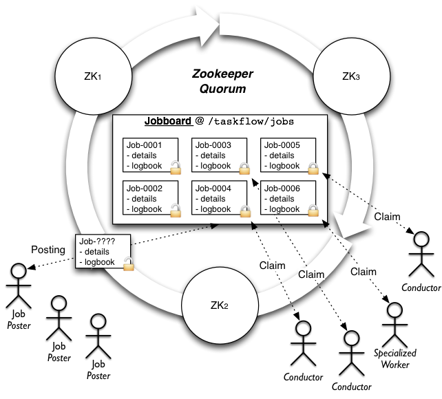

----
Jobs
----

Overview
========

Jobs and jobboards are a **novel** concept that TaskFlow provides to allow for
automatic ownership transfer of workflows between capable owners (those owners
usually then use :doc:`engines <engines>` to complete the workflow). They
provide the necessary semantics to be able to atomically transfer a job from a
producer to a consumer in a reliable and fault tolerant manner. They are
modeled off the concept used to post and acquire work in the physical world
(typically a job listing in a newspaper or online website serves a similar
role).

**TLDR:** It's similar to a queue, but consumers lock items on the queue when
claiming them, and only remove them from the queue when they're done with the
work. If the consumer fails, the lock is *automatically* released and the item
is back on the queue for further consumption.

.. note::

    For more information, please visit the `paradigm shift`_ page for
    more details.

Definitions
===========

Jobs
  A :py:class:`job <taskflow.jobs.base.Job>` consists of a unique identifier,
  name, and a reference to a :py:class:`logbook
  <taskflow.persistence.logbook.LogBook>` which contains the details of the
  work that has been or should be/will be completed to finish the work that has
  been created for that job.

Jobboards
  A :py:class:`jobboard <taskflow.jobs.base.JobBoard>` is responsible for
  managing the posting, ownership, and delivery of jobs. It acts as the
  location where jobs can be posted, claimed and searched for; typically by
  iteration or notification.  Jobboards may be backed by different *capable*
  implementations (each with potentially differing configuration) but all
  jobboards implement the same interface and semantics so that the backend
  usage is as transparent as possible. This allows deployers or developers of a
  service that uses TaskFlow to select a jobboard implementation that fits
  their setup (and there intended usage) best.

High level architecture
=======================

Features
========

- High availability

  - Guarantees workflow forward progress by transferring partially complete
    work or work that has not been started to entities which can either resume
    the previously partially completed work or begin initial work to ensure
    that the workflow as a whole progresses (where progressing implies
    transitioning through the workflow :doc:`patterns <patterns>` and
    :doc:`atoms <atoms>` and completing their associated state transitions).

- Atomic transfer and single ownership

  - Ensures that only one workflow is managed (aka owned) by a single owner at
    a time in an atomic manner (including when the workflow is transferred to
    a owner that is resuming some other failed owners work). This avoids
    contention and ensures a workflow is managed by one and only one entity at
    a time.
  - *Note:* this does not mean that the owner needs to run the
    workflow itself but instead said owner could use an engine that runs the
    work in a distributed manner to ensure that the workflow progresses.

- Separation of workflow construction and execution

  - Jobs can be created with logbooks that contain a specification of the work
    to be done by a entity (such as an API server). The job then can be
    completed by a entity that is watching that jobboard (not necessarily the
    API server itself). This creates a disconnection between work
    formation and work completion that is useful for scaling out horizontally.

- Asynchronous completion

  - When for example a API server posts a job for completion to a
    jobboard that API server can return a *tracking* identifier to the user
    calling the API service. This  *tracking* identifier can be used by the
    user to poll for status (similar in concept to a shipping *tracking*
    identifier created by fedex or UPS).

Usage
=====

All engines are mere classes that implement same interface, and of course it is
possible to import them and create their instances just like with any classes
in Python. But the easier (and recommended) way for creating jobboards is by
using the :py:meth:`fetch() <taskflow.jobs.backends.fetch>` function which uses
entrypoints (internally using `stevedore`_) to fetch and configure your backend

Using this function the typical creation of a jobboard (and an example posting
of a job) might look like:

.. code-block:: python

    from taskflow.persistence import backends as persistence_backends
    from taskflow.jobs import backends as job_backends

    ...
    persistence = persistence_backends.fetch({
        "connection': "mysql",
        "user": ...,
        "password": ...,
    })
    book = make_and_save_logbook(persistence)
    board = job_backends.fetch('my-board', {
        "board": "zookeeper",
    }, persistence=persistence)
    job = board.post("my-first-job", book)
    ...

Consumption of jobs is similarly achieved by creating a jobboard and using
the iteration functionality to find and claim jobs (and eventually consume
them). The typical usage of a jobboard for consumption (and work completion)
might look like:

.. code-block:: python

    import time

    from taskflow import exceptions as exc
    from taskflow.persistence import backends as persistence_backends
    from taskflow.jobs import backends as job_backends

    ...
    my_name = 'worker-1'
    coffee_break_time = 60
    persistence = persistence_backends.fetch({
        "connection': "mysql",
        "user": ...,
        "password": ...,
    })
    board = job_backends.fetch('my-board', {
        "board": "zookeeper",
    }, persistence=persistence)
    while True:
        my_job = None
        for job in board.iterjobs(only_unclaimed=True):
            try:
                board.claim(job, my_name)
            except exc.UnclaimableJob:
                pass
            else:
                my_job = job
                break
        if my_job is not None:
            try:
                perform_job(my_job)
            except Exception:
                LOG.exception("I failed performing job: %s", my_job)
                board.abandon(my_job, my_name)
            else:
                # I finished it, now cleanup.
                board.consume(my_job)
                persistence.get_connection().destroy_logbook(my_job.book.uuid)
        time.sleep(coffee_break_time)
    ...

Types
=====

Zookeeper
---------

**Board type**: ``'zookeeper'``

Uses `zookeeper`_ to provide the jobboard capabilities and semantics by using
a zookeeper directory, ephemeral, non-ephemeral nodes and watches.

Additional *kwarg* parameters:

* ``client``: a class that provides ``kazoo.client.KazooClient``-like
  interface; it will be used for zookeeper interactions, sharing clients
  between jobboard instances will likely provide better scalability and can
  help avoid creating to many open connections to a set of zookeeper servers.
* ``persistence``: a class that provides a :doc:`persistence <persistence>`
  backend interface; it will be used for loading jobs logbooks for usage at
  runtime or for usage before a job is claimed for introspection.

Additional *configuration* parameters:

* ``path``: the root zookeeper path to store job information (*defaults* to
  ``/taskflow/jobs``)
* ``hosts``: the list of zookeeper hosts to connect to (*defaults* to
  ``localhost:2181``); only used if a client is not provided.
* ``timeout``: the timeout used when performing operations with zookeeper;
  only used if a client is not provided.
* ``handler``: a class that provides ``kazoo.handlers``-like interface; it will
  be used internally by `kazoo`_ to perform asynchronous operations, useful
  when your program uses eventlet and you want to instruct kazoo to use an
  eventlet compatible handler (such as the `eventlet handler`_).

.. note::

    See :py:class:`~taskflow.jobs.backends.impl_zookeeper.ZookeeperJobBoard`
    for implementation details.

Considerations
==============

Some usage considerations should be used when using a jobboard to make sure
it's used in a safe and reliable manner. Eventually we hope to make these
non-issues but for now they are worth mentioning.

Dual-engine jobs
----------------

**What:** Since atoms and engines are not currently `preemptable`_ we can not
force a engine (or the threads/remote workers... it is using to run) to stop
working on an atom (it is general bad behavior to force code to stop without
its consent anyway) if it has already started working on an atom (short of
doing a ``kill -9`` on the running interpreter).  This could cause problems
since the points an engine can notice that it no longer owns a claim is at any
:doc:`state <states>` change that occurs (transitioning to a new atom or
recording a result for example), where upon noticing the claim has been lost
the engine can immediately stop doing further work. The effect that this causes
is that when a claim is lost another engine can immediately attempt to acquire
the claim that was previously lost and it *could* begin working on the
unfinished tasks that the later engine may also still be executing (since that
engine is not yet aware that it has *lost* the claim).

**TLDR:** not `preemptable`_, possible to become aware of losing a claim
after the fact (at the next state change), another engine could have acquired
the claim by then, therefore both would be *working* on a job.

**Alleviate by:**

#. Ensure your atoms are `idempotent`_, this will cause an engine that may be
   executing the same atom to be able to continue executing without causing
   any conflicts/problems (idempotency guarantees this).
#. On claiming jobs that have been claimed previously enforce a policy that
   happens before the jobs workflow begins to execute (possibly prior to an
   engine beginning the jobs work) that ensures that any prior work has been
   rolled back before continuing rolling forward. For example:

   * Rolling back the last atom/set of atoms that finished.
   * Rolling back the last state change that occurred.

#. Delay claiming partially completed work by adding a wait period (to allow
   the previous engine to coalesce) before working on a partially completed job
   (combine this with the prior suggestions and *most* dual-engine issues
   should be avoided).

.. _idempotent: http://en.wikipedia.org/wiki/Idempotence
.. _preemptable: http://en.wikipedia.org/wiki/Preemption_%28computing%29

Interfaces
==========

.. automodule:: taskflow.jobs.base
.. automodule:: taskflow.jobs.backends

Implementations
===============

.. automodule:: taskflow.jobs.backends.impl_zookeeper

Hierarchy
=========

.. inheritance-diagram::
    taskflow.jobs.base
    taskflow.jobs.backends.impl_zookeeper
    :parts: 1

.. _paradigm shift: https://wiki.openstack.org/wiki/TaskFlow/Paradigm_shifts#Workflow_ownership_transfer
.. _zookeeper: http://zookeeper.apache.org/
.. _kazoo: http://kazoo.readthedocs.org/
.. _eventlet handler: https://pypi.python.org/pypi/kazoo-eventlet-handler/
.. _stevedore: http://stevedore.readthedocs.org/
