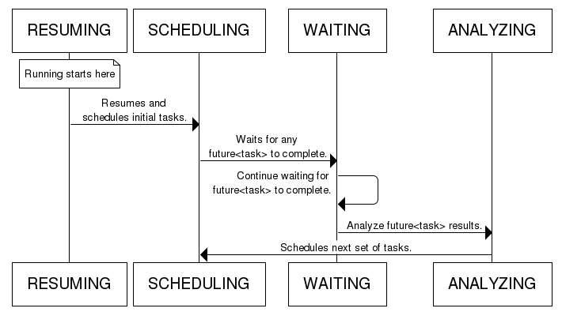
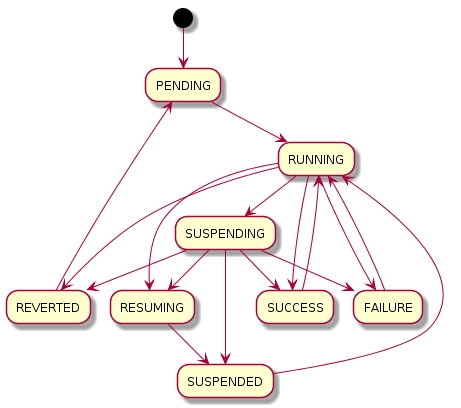
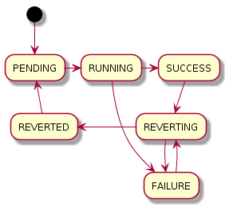
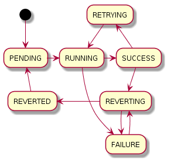

------
States
------

.. _engine states:

Engine
======

Executing
---------

**RESUMING** - Prepare flow to be resumed.

**SCHEDULING** - Schedule nodes to be worked on.

**WAITING** - Wait for nodes to finish executing.

**ANALYZING** - Analyze and process result/s of node completion.

End
---

**SUCCESS** - Engine completed successfully.

**REVERTED** - Engine reverting was induced and all nodes were not completed
successfully.

**SUSPENDED** - Engine was suspended while running..

Flow
====

**PENDING** - A flow starts its life in this state.

**RUNNING** - In this state flow makes a progress, executes and/or reverts its
tasks.

**SUCCESS** - Once all tasks have finished successfully the flow transitions to
the SUCCESS state.

**REVERTED** - The flow transitions to this state when it has been reverted
successfully after the failure.

**FAILURE** - The flow transitions to this state when it can not be reverted
after the failure.

**SUSPENDING** - In the RUNNING state the flow can be suspended. When this
happens, flow transitions to the SUSPENDING state immediately. In that state
the engine running the flow waits for running tasks to finish (since the engine
can not preempt tasks that are active).

**SUSPENDED** - When no tasks are running and all results received so far are
saved, the flow transitions from the SUSPENDING state to SUSPENDED. Also it may
go to the SUCCESS state if all tasks were in fact ran, or to the REVERTED state
if the flow was reverting and all tasks were reverted while the engine was
waiting for running tasks to finish, or to the FAILURE state if tasks were run
or reverted and some of them failed.

**RESUMING** - When the flow is interrupted 'in a hard way' (e.g. server
crashed), it can be loaded from storage in any state. If the state is not
PENDING (aka, the flow was never ran) or SUCCESS, FAILURE or REVERTED (in which
case the flow has already finished), the flow gets set to the RESUMING state
for the short time period while it is being loaded from backend storage [a
database, a filesystem...] (this transition is not shown on the diagram). When
the flow is finally loaded, it goes to the SUSPENDED state.

From the SUCCESS, FAILURE or REVERTED states the flow can be ran again (and
thus it goes back into the RUNNING state). One of the possible use cases for
this transition is to allow for alteration of a flow or flow details associated
with a previously ran flow after the flow has finished, and client code wants
to ensure that each task from this new (potentially updated) flow has its
chance to run.

.. note::

  The current code also contains strong checks during each flow state
  transition using the model described above and raises the InvalidState
  exception if an invalid transition is attempted. This exception being
  triggered usually means there is some kind of bug in the engine code or some
  type of misuse/state violation is occurring, and should be reported as such.

Task
====

**PENDING** - When a task is added to a flow, it starts in the PENDING state,
which means it can be executed immediately or waits for all of task it depends
on to complete.  The task transitions to the PENDING state after it was
reverted and its flow was restarted or retried.

**RUNNING** - When flow starts to execute the task, it transitions to the
RUNNING state, and stays in this state until its execute() method returns.

**SUCCESS** - The task transitions to this state after it was finished
successfully.

**FAILURE** - The task transitions to this state after it was finished with
error. When the flow containing this task is being reverted, all its tasks are
walked in particular order.

**REVERTING** - The task transitions to this state when the flow starts to
revert it and its revert() method is called. Only tasks in the SUCCESS or
FAILURE state can be reverted.  If this method fails (raises exception), task
goes to the FAILURE state.

**REVERTED** - The task that has been reverted appears it this state.

Retry
=====

Retry has the same states as a task and one additional state.

**PENDING** - When a retry is added to a flow, it starts in the PENDING state,
which means it can be executed immediately or waits for all of task it depends
on to complete.  The retry transitions to the PENDING state after it was
reverted and its flow was restarted or retried.

**RUNNING** - When flow starts to execute the retry, it transitions to the
RUNNING state, and stays in this state until its execute() method returns.

**SUCCESS** - The retry transitions to this state after it was finished
successfully.

**FAILURE** - The retry transitions to this state after it was finished with
error. When the flow containing this retry is being reverted, all its tasks are
walked in particular order.

**REVERTING** - The retry transitions to this state when the flow starts to
revert it and its revert() method is called. Only retries in SUCCESS or FAILURE
state can be reverted.  If this method fails (raises exception), task goes to
the FAILURE.

**REVERTED** - The retry that has been reverted appears it this state.

**RETRYING** - If flow that is managed by the current retry was failed and
reverted, the retry prepares it for the next run and transitions to the
RETRYING state.

