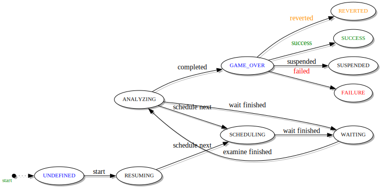
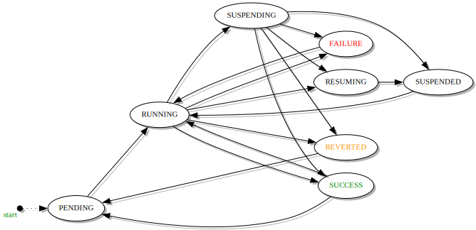
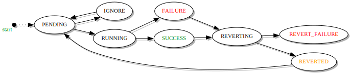
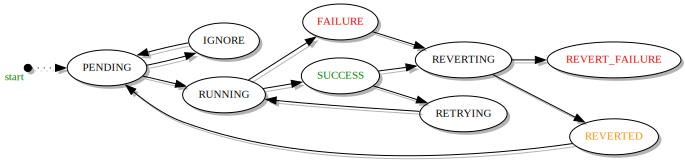

------
States
------

.. _engine states:

.. note::

  The code contains explicit checks during transitions using the models
  described below. These checks ensure that a transition is valid, if the
  transition is determined to be invalid the transitioning code will raise
  a :py:class:`~taskflow.exceptions.InvalidState` exception. This exception
  being triggered usually means there is some kind of bug in the code or some
  type of misuse/state violation is occurring, and should be reported as such.

Engine
======

**RESUMING** - Prepares flow & atoms to be resumed.

**SCHEDULING** - Schedules and submits atoms to be worked on.

**WAITING** - Wait for atoms to finish executing.

**ANALYZING** - Analyzes and processes result/s of atom completion.

**SUCCESS** - Completed successfully.

**FAILURE** - Completed unsuccessfully.

**REVERTED** - Reverting was induced and all atoms were **not** completed
successfully.

**SUSPENDED** - Suspended while running.

**UNDEFINED** - *Internal state.*

**GAME_OVER** - *Internal state.*

Flow
====

**PENDING** - A flow starts (or
via :py:meth:`~taskflow.engines.base.Engine.reset`) its execution lifecycle
in this state (it has no state prior to being ran by an engine, since
flow(s) are just pattern(s) that define the semantics and ordering of their
contents and flows gain state only when they are executed).

**RUNNING** - In this state the engine running a flow progresses through the
flow.

**SUCCESS** - Transitioned to once all of the flows atoms have finished
successfully.

**REVERTED** - Transitioned to once all of the flows atoms have been reverted
successfully after a failure.

**FAILURE** - The engine will transition the flow to this state when it can not
be reverted after a single failure or after multiple failures (greater than
one failure *may* occur when running in parallel).

**SUSPENDING** - In the ``RUNNING`` state the engine running the flow can be
suspended. When this happens, the engine attempts to transition the flow
to the ``SUSPENDING`` state immediately. In that state the engine running the
flow waits for running atoms to finish (since the engine can not preempt
atoms that are actively running).

**SUSPENDED** - When no atoms are running and all results received so far have
been saved, the engine transitions the flow from the ``SUSPENDING`` state
to the ``SUSPENDED`` state.

.. note::

  The engine may transition the flow to the ``SUCCESS`` state (from the
  ``SUSPENDING`` state) if all atoms were in fact running (and completed)
  before the suspension request was able to be honored (this is due to the lack
  of preemption) or to the ``REVERTED`` state if the engine was reverting and
  all atoms were reverted while the engine was waiting for running atoms to
  finish or to the ``FAILURE`` state if atoms were running or reverted and
  some of them had failed.

**RESUMING** - When the engine running a flow is interrupted *'in a
hard way'* (e.g. server crashed), it can be loaded from storage in *any*
state (this is required since it is can not be known what state was last
successfully saved). If the loaded state is not ``PENDING`` (aka, the flow was
never ran) or ``SUCCESS``, ``FAILURE`` or ``REVERTED`` (in which case the flow
has already finished), the flow gets set to the ``RESUMING`` state for the
short time period while it is being loaded from backend storage [a database, a
filesystem...] (this transition is not shown on the diagram). When the flow is
finally loaded, it goes to the ``SUSPENDED`` state.

From the ``SUCCESS``, ``FAILURE`` or ``REVERTED`` states the flow can be ran
again; therefore it is allowable to go back into the ``RUNNING`` state
immediately. One of the possible use cases for this transition is to allow for
alteration of a flow or flow details associated with a previously ran flow
after the flow has finished, and client code wants to ensure that each atom
from this new (potentially updated) flow has its chance to run.

Task
====

**PENDING** - A task starts its execution lifecycle in this state (it has no
state prior to being ran by an engine, since tasks(s) are just objects that
represent how to accomplish a piece of work). Once it has been transitioned to
the ``PENDING`` state by the engine this means it can be executed immediately
or if needed will wait for all of the atoms it depends on to complete.

.. note::

  An engine running a task also transitions the task to the ``PENDING`` state
  after it was reverted and its containing flow was restarted or retried.

**IGNORE** - When a conditional decision has been made to skip (not
execute) the task the engine will transition the task to
the ``IGNORE`` state.

**RUNNING** - When an engine running the task starts to execute the task, the
engine will transition the task to the ``RUNNING`` state, and the task will
stay in this state until the tasks :py:meth:`~taskflow.atom.Atom.execute`
method returns.

**SUCCESS** - The engine running the task transitions the task to this state
after the task has finished successfully (ie no exception/s were raised during
running its :py:meth:`~taskflow.atom.Atom.execute` method).

**FAILURE** - The engine running the task transitions the task to this state
after it has finished with an error (ie exception/s were raised during
running its :py:meth:`~taskflow.atom.Atom.execute` method).

**REVERT_FAILURE** - The engine running the task transitions the task to this
state after it has finished with an error (ie exception/s were raised during
running its :py:meth:`~taskflow.atom.Atom.revert` method).

**REVERTING** - The engine running a task transitions the task to this state
when the containing flow the engine is running starts to revert and
its :py:meth:`~taskflow.atom.Atom.revert` method is called. Only tasks in
the ``SUCCESS`` or ``FAILURE`` state can be reverted.  If this method fails (ie
raises an exception), the task goes to the ``REVERT_FAILURE`` state.

**REVERTED** - The engine running the task transitions the task to this state
after it has successfully reverted the task (ie no exception/s were raised
during running its :py:meth:`~taskflow.atom.Atom.revert` method).

Retry
=====

.. note::

  A retry has the same states as a task and one additional state.

**PENDING** - A retry starts its execution lifecycle in this state (it has no
state prior to being ran by an engine, since retry(s) are just objects that
represent how to retry an associated flow). Once it has been transitioned to
the ``PENDING`` state by the engine this means it can be executed immediately
or if needed will wait for all of the atoms it depends on to complete (in the
retry case the retry object will also be consulted when failures occur in the
flow that the retry is associated with by consulting its
:py:meth:`~taskflow.retry.Decider.on_failure` method).

.. note::

  An engine running a retry also transitions the retry to the ``PENDING`` state
  after it was reverted and its associated flow was restarted or retried.

**IGNORE** - When a conditional decision has been made to skip (not
execute) the retry the engine will transition the retry to
the ``IGNORE`` state.

**RUNNING** - When an engine starts to execute the retry, the engine
transitions the retry to the ``RUNNING`` state, and the retry stays in this
state until its :py:meth:`~taskflow.retry.Retry.execute` method returns.

**SUCCESS** - The engine running the retry transitions it to this state after
it was finished successfully (ie no exception/s were raised during
execution).

**FAILURE** - The engine running the retry transitions the retry to this state
after it has finished with an error (ie exception/s were raised during
running its :py:meth:`~taskflow.retry.Retry.execute` method).

**REVERT_FAILURE** - The engine running the retry transitions the retry to
this state after it has finished with an error (ie exception/s were raised
during its :py:meth:`~taskflow.retry.Retry.revert` method).

**REVERTING** - The engine running the retry transitions to this state when
the associated flow the engine is running starts to revert it and its
:py:meth:`~taskflow.retry.Retry.revert` method is called. Only retries
in ``SUCCESS`` or ``FAILURE`` state can be reverted. If this method fails (ie
raises an exception), the retry goes to the ``REVERT_FAILURE`` state.

**REVERTED** - The engine running the retry transitions the retry to this state
after it has successfully reverted the retry (ie no exception/s were raised
during running its :py:meth:`~taskflow.retry.Retry.revert` method).

**RETRYING** - If flow that is associated with the current retry was failed and
reverted, the engine prepares the flow for the next run and transitions the
retry to the ``RETRYING`` state.

Jobs
====

**UNCLAIMED** - A job (with details about what work is to be completed) has
been initially posted (by some posting entity) for work on by some other
entity (for example a :doc:`conductor <conductors>`). This can also be a state
that is entered when some owning entity has manually abandoned (or
lost ownership of) a previously claimed job.

**CLAIMED** - A job that is *actively* owned by some entity; typically that
ownership is tied to jobs persistent data via some ephemeral connection so
that the job ownership is lost (typically automatically or after some
timeout) if that ephemeral connection is lost.

**COMPLETE** - The work defined in the job has been finished by its owning
entity and the job can no longer be processed (and it *may* be removed at
some/any point in the future).
